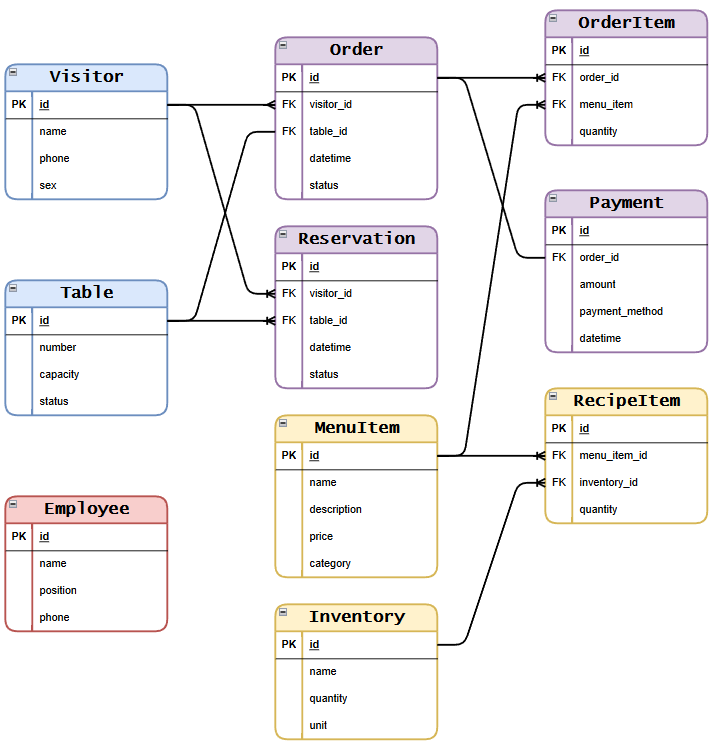

<h1><b>Ресторан</b></h1>

<table text-align:center>
  <tr>
    <td colspan=2>
      <h2 >Технологии:</h2>
    </td>
  </tr>
    
<tr>
  <td><h3>Backend</h3></td>
  <td><h3>Frontend</td>
</tr>

<tr>
  <td>
    <ul>
      <li>
Node.JS
</li>
      <li>
Express
</li>
      <li>
PostgreSQL
</li>
      <li>
Sequelize
</li>
    </ul>
  </td>
  <td>
    
  </td>
</tr>
</table>
<h2>Сущности и связи:</h2>

<h2>API:</h2>
<ul>
  <li><h3>localhost:5000/api/visitor/{id}</h3> - посетители ресторана</li>
  <li><h3>localhost:5000/api/table/{id}</h3> - столики</li>
  <li><h3>localhost:5000/api/employee/{id}</h3> - сотрудники ресторана</li>
  <li><h3>localhost:5000/api/order/{id}</h3> - заказы в ресторане</li>
  <li><h3>localhost:5000/api/reservation/{id}</h3> - резервирование столиков</li>
  <li><h3>localhost:5000/api/menuitem/{id}</h3> - позиции (блюда) в меню</li>
  <li><h3>localhost:5000/api/inventory/{id}</h3> - ингредиенты на складе</li>
  <li><h3>localhost:5000/api/orderitem/{id}</h3> - конкретное блюдо (позиция) в заказе</li>
  <li><h3>localhost:5000/api/payment/{id}</h3> - оплата (чек)</li>
  <li><h3>localhost:5000/api/recipeitem/{id}</h3> - ингредиент в рецепте блюда</li>
</ul>
